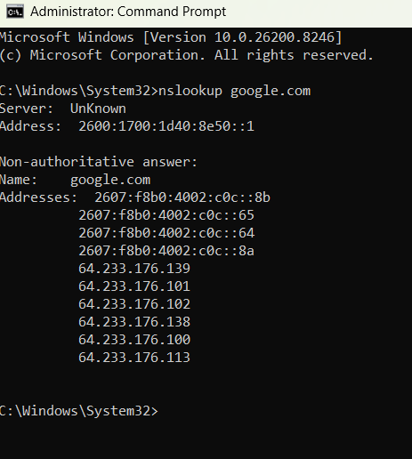
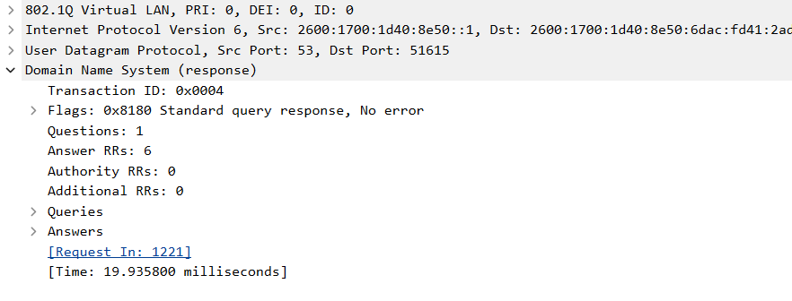
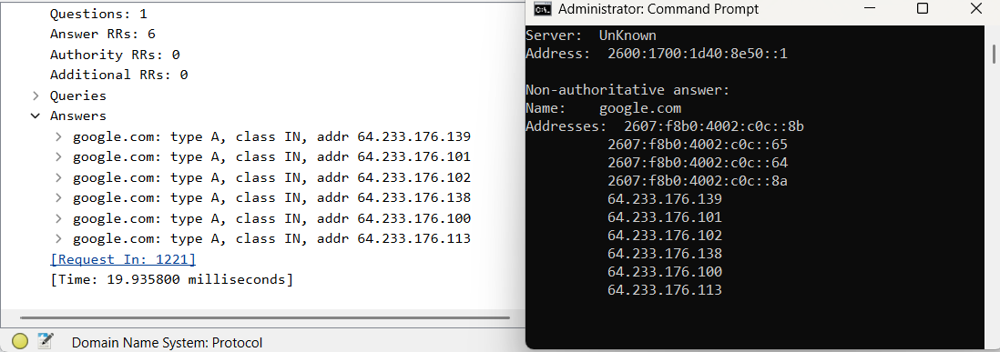
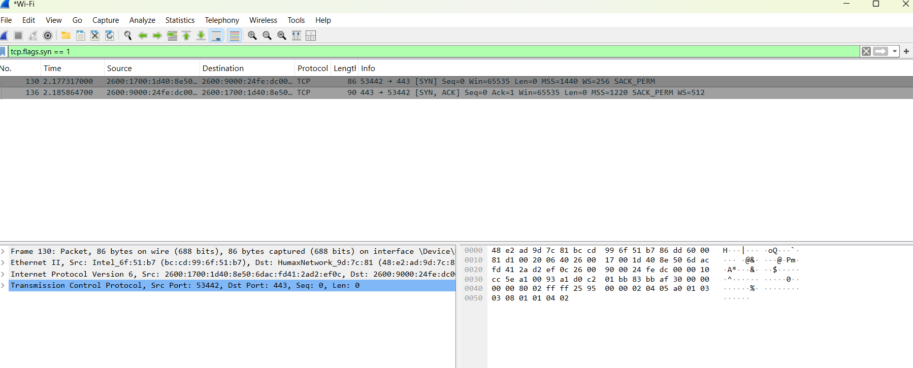
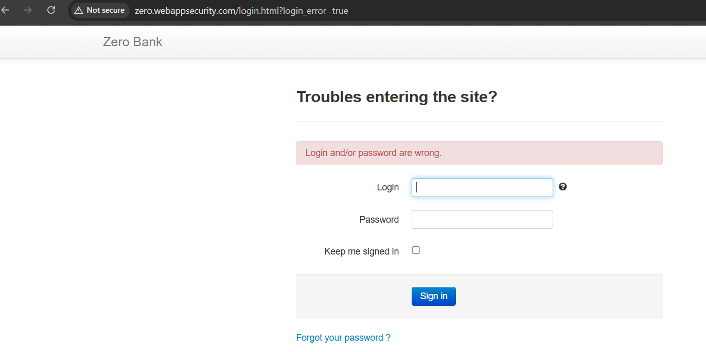
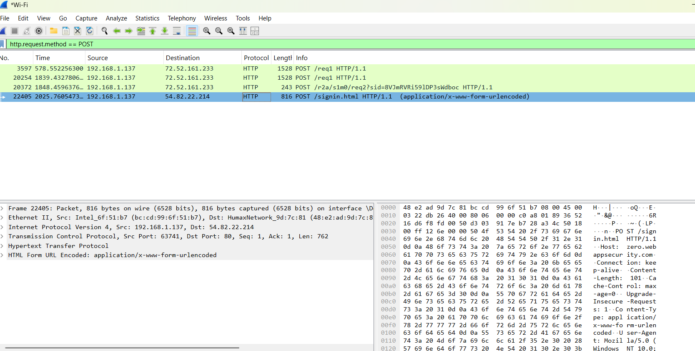
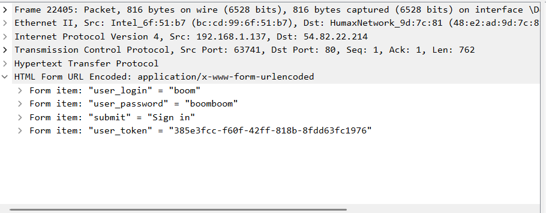
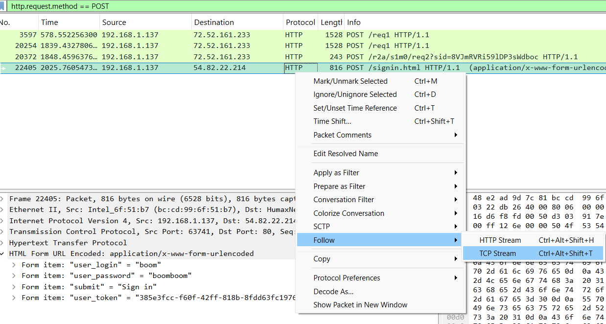
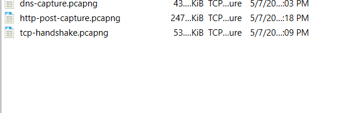

## Step 1 — Launch Wireshark and Select the Wi-Fi Interface

Wireshark was launched and the Wi-Fi interface was selected based on the active waveform indicating live network traffic. Selecting the correct interface is critical — capturing on the wrong interface results in no packets being recorded.

---

## Step 2 — Live Packet Capture Begins

Wireshark began capturing packets in real time, recording every frame passing through the Wi-Fi interface. The capture shows mixed TCP, UDP, and ARP traffic — this raw unfiltered view is what analysts work with before applying display filters to isolate specific traffic of interest.

---

## Step 3 — Open Administrator Command Prompt

Command Prompt was opened with Administrator privileges. Wireshark is a passive capture tool — it records traffic but does not generate it. All commands are run in a separate terminal while Wireshark captures in the background.

---

## Step 4 — Run nslookup to Generate DNS Traffic

The command nslookup google.com was run to manually trigger a DNS query. This is a common technique used by analysts to generate known traffic on demand and confirm Wireshark is capturing correctly. The terminal returned both IPv4 and IPv6 addresses for google.com confirming the DNS resolution was successful.

---

## Step 5 — Apply DNS Display Filter

The display filter dns was applied to isolate DNS traffic from thousands of captured packets. In real-world investigations this filter is used to quickly identify unusual or suspicious domain lookups — unexpected DNS queries to unknown domains are often the first indicator of malware communicating with a command and control server.

---

## Step 6 — Identify the DNS Response Packet

Packet 1222 contains the DNS response from the server. The query and response share Transaction ID 0x0004 confirming they are a matched pair. Being able to match DNS queries to their responses is a core skill in network troubleshooting and threat investigation.

---

## Step 7 — Expand the DNS Response Packet Details

The DNS response packet was expanded in the details pane to inspect its full structure. The packet confirms a successful resolution with 6 Answer Resource Records, no errors, and a response time of 19.935800 milliseconds. This level of packet inspection is used to verify DNS behaviour and identify anomalies such as unusually long response times or unexpected record counts.

---

## Step 8 — Correlate DNS Answers with nslookup Output

The DNS Answers section in Wireshark was compared side-by-side with the nslookup terminal output. Both returned identical IP addresses for google.com confirming that Wireshark captured the exact DNS exchange that nslookup triggered. This validation technique is used to prove that a capture is recording the expected traffic before moving to deeper analysis.

---

## Step 9 — Identify the TCP Three-Way Handshake

The display filter tcp.flags.syn == 1 was applied to isolate TCP connection initiation packets. Packets 130 and 136 show the SYN and SYN-ACK of the three-way handshake. Recognising this pattern is fundamental to network analysis — a SYN with no SYN-ACK response indicates a refused or unreachable connection, while a RST packet indicates a forcibly closed connection. These are the first things a network engineer checks when diagnosing a connectivity problem.

---

## Step 10 — Navigate to an Insecure HTTP Login Page

The browser was navigated to zero.webappsecurity.com — an intentionally insecure HTTP training site. The address bar confirms the connection is unencrypted. This exercise demonstrates why HTTPS is mandatory for any site handling sensitive data — without encryption, all traffic including credentials is transmitted in plaintext and visible to anyone on the network path.

---

## Step 11 — Capture Plaintext Credentials over HTTP

The display filter http.request.method == POST was applied to isolate the login request. Expanding the captured packet in the details pane reveals the form data transmitted in complete plaintext — the username and password are fully readable with no decryption required. This is the exact technique security teams use to demonstrate credential exposure vulnerabilities to developers and stakeholders.

---

## Step 12 — Follow TCP Stream to Reconstruct the HTTP Conversation

The HTTP POST packet was right-clicked and Follow TCP Stream was selected. This feature reassembles all packets from a connection into a readable conversation — essential for understanding what data was actually transferred between two hosts during an incident.

---

## Step 13 — TCP Stream Reconstruction Output

The Follow TCP Stream window displayed the complete HTTP exchange in ASCII format including the full request headers, the plaintext credentials in the request body, the server's 302 redirect response, and the session cookie issued by the server. This technique is used by incident responders and threat hunters to reconstruct exactly what happened during a network event from individual packet fragments.

---

## Saved Capture Files

Three capture files were saved from this lab session as portfolio evidence and for further analysis.

| File | Size | Contents |
|------|------|----------|
| dns-capture.pcapng | ~43 KiB | DNS lookup exercise |
| http-post-capture.pcapng | ~247 KiB | HTTP credential capture and TCP stream |
| tcp-handshake.pcapng | ~53 KiB | TCP three-way handshake |

---

## Key Takeaways

This lab demonstrated hands-on experience with:

- Capturing and filtering live network traffic using Wireshark
- Generating DNS queries via command line and tracing them through query and response packets
- Identifying the TCP three-way handshake and understanding what incomplete handshakes indicate
- Demonstrating how plaintext credentials are fully exposed over unencrypted HTTP connections
- Reconstructing complete HTTP conversations from individual packets using Follow TCP Stream
- Saving packet captures in pcapng format as reproducible evidence
