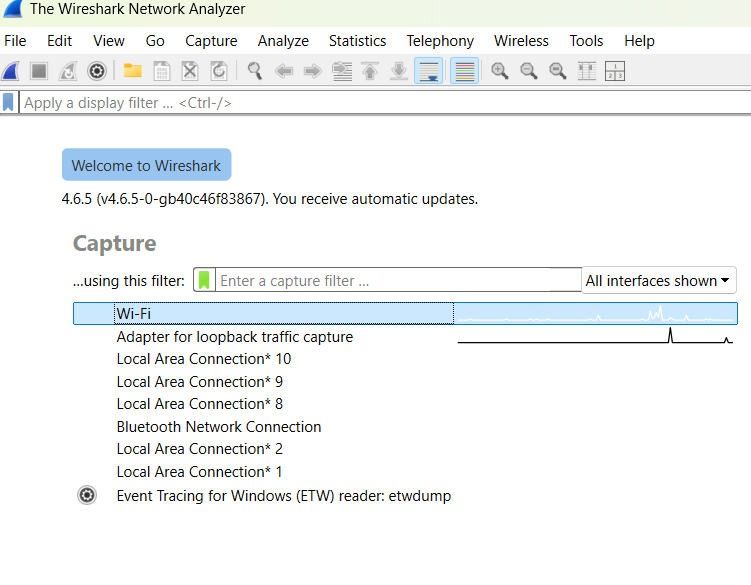
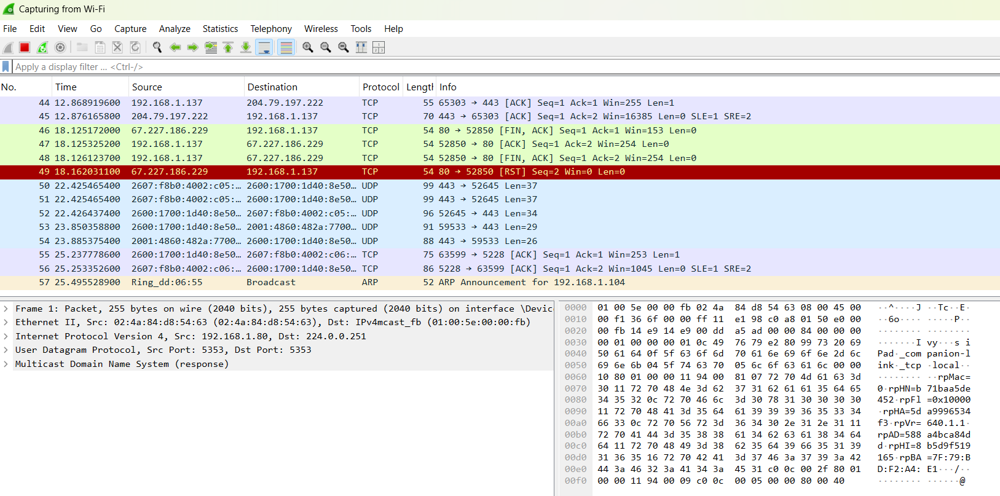
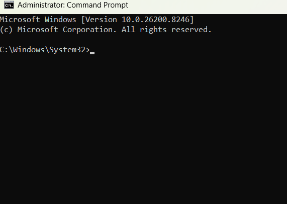
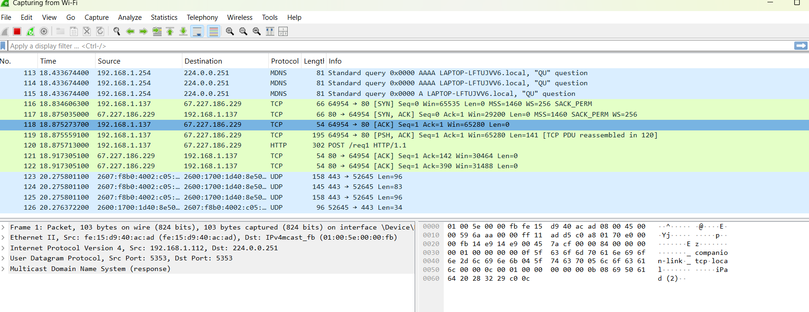
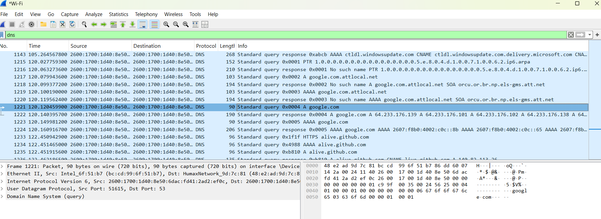
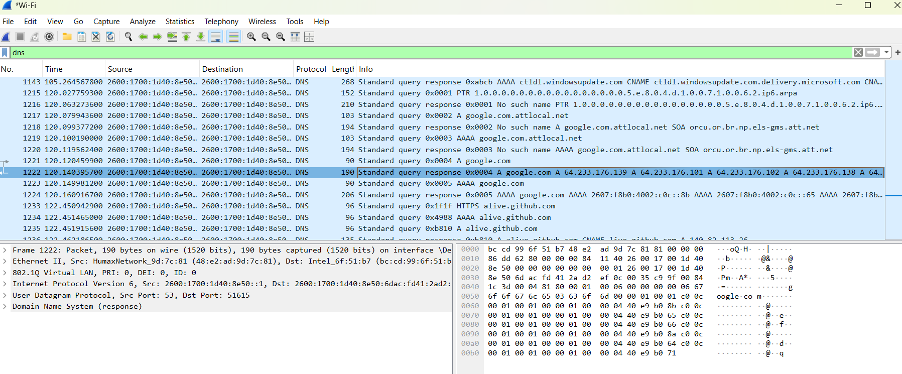
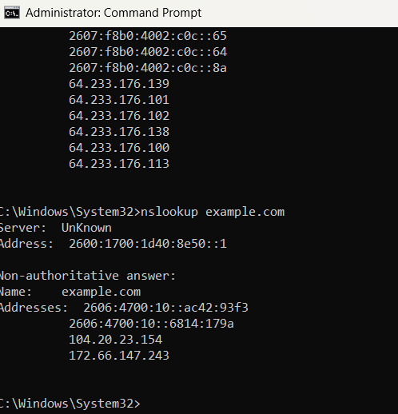
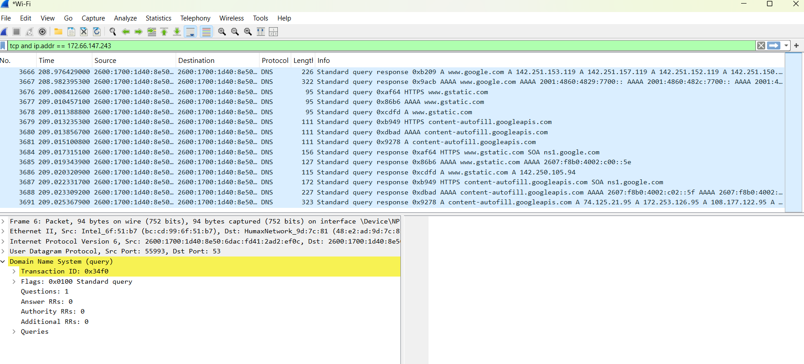

# Wireshark Network Analysis Lab

## Overview
This lab focused on capturing and analyzing live network traffic using Wireshark. The objective was to understand how common network protocols operate in real time and how analysts investigate traffic during troubleshooting and security investigations.

During the lab, I captured and analyzed DNS requests, TCP handshakes, HTTP traffic, and POST requests. I also reconstructed TCP streams and observed how credentials can be transmitted in plaintext over insecure HTTP connections.

This project demonstrates foundational networking, packet analysis, and SOC-style investigation skills relevant to cybersecurity, help desk, and network support roles.

---

# Tools Used

- Wireshark
- Windows Command Prompt
- nslookup
- Zero Web Application Security Demo Site
- Altoro Mutual Demo Login Site

---

# Skills Demonstrated

- Packet capture and analysis
- DNS query and response analysis
- TCP three-way handshake analysis
- Wireshark display filtering
- HTTP POST request inspection
- Cleartext credential analysis
- TCP stream reconstruction
- Packet export and evidence preservation

---

# Step 1 — Starting Wireshark Capture

Wireshark was launched and configured to capture traffic on the active Wi-Fi network interface.



---

# Step 2 — DNS Query Analysis

A DNS lookup was generated using the `nslookup google.com` command. Wireshark captured the DNS query packet requesting the A record for Google.



---

# Step 3 — DNS Response Analysis

Wireshark captured the DNS response packet containing the resolved IP addresses returned by the DNS server.



---

# Step 4 — Expanded DNS Packet Details

The DNS packet details pane was expanded to analyze:

- Transaction ID
- Queries
- Answers
- Request and response matching



---

# Step 5 — TCP Three-Way Handshake

A TCP connection was analyzed to identify the complete TCP three-way handshake:

- SYN
- SYN-ACK
- ACK

This demonstrated how a successful TCP connection is established between a client and server.


---

# Step 6 — TCP SYN Display Filter

The following Wireshark display filter was used to isolate TCP connection attempts:

```bash
tcp.flags.syn == 1
```



---

# Step 7 — DNS Display Filter

The following Wireshark display filter was used to isolate DNS traffic:

```bash
dns
```



---

# Step 8 — HTTP POST Request Analysis

HTTP POST requests were analyzed to inspect unencrypted web traffic and observe how data is transmitted over HTTP.

The following display filter was used:

```bash
http.request.method == POST
```


---

# Step 9 — Credential Capture Analysis

A test login request was captured over HTTP. The packet details showed how credentials submitted through an insecure HTTP connection can be visible in plaintext.

This exercise demonstrated the importance of HTTPS encryption.


---

# Step 10 — Follow TCP Stream Reconstruction

Wireshark’s “Follow TCP Stream” feature was used to reconstruct the full HTTP conversation between the client and server.

This technique is commonly used during:

- Incident response
- Traffic investigations
- Threat hunting
- Malware analysis



---

# Step 11 — Insecure HTTP Login Page

An intentionally insecure HTTP login page was used during testing to demonstrate how credentials can be intercepted when encryption is not enabled.

The browser displayed a “Not Secure” warning because the site used HTTP instead of HTTPS.



---

# Step 12 — Exported Packet Capture Files

Packet captures were exported and saved in `.pcapng` format for documentation and future analysis.

Saved capture files:

- dns-capture.pcapng
- tcp-handshake.pcapng
- http-post-capture.pcapng


---

# Key Takeaways

This lab provided hands-on experience with real-world packet analysis and network troubleshooting concepts.

Key concepts learned:

- How DNS queries and responses operate
- How TCP connections are established
- How to apply Wireshark display filters
- How HTTP traffic differs from HTTPS
- How analysts reconstruct TCP conversations
- Why unencrypted credentials create security risks

---

# Career Relevance

This lab demonstrates practical skills relevant to:

- SOC Analyst
- Cybersecurity Analyst
- Help Desk Support
- Incident Response
- Network Support
- Cloud Security

---

# Author

Miyanda Liddell

Aspiring Cybersecurity Analyst | CompTIA Security+ Certified
